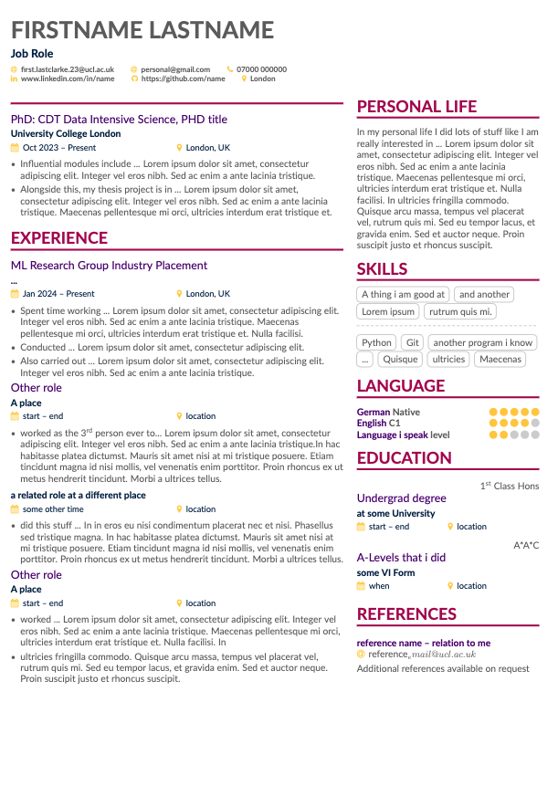

## CV Template for group CDT CV mailing list

Upload this into [overleaf](https://www.overleaf.com), or download and use a LaTeX editor of your choice to begin editing.

## Guidelines
- Please refrain from modifying files other than `main.tex` (unless you are bug fixing, in which case please submit a pull request).

- You can include as many/as few of the contact options in the `\personalinfo` section as you are comfortable, but make sure to include university email at a minimum so that partners have a way to contact you.

- Please **DO NOT** include an image in your CV, if you wish to link to social media such as LinkedIn where there are images of you available this is permitted, but by no means required.

- Include your Group Project, it's a great way to kick off your experience section. It may be worth mentioning what new skills you might have been learnt here e.g. project planning, client-facing communication, a new coding language, applying ML/stats skills for real-life data problems etc.

- You don't need to go crazy for the 'Extracurricular Activities' section, it's just to give partners a flavour for who you are outside of the CDT. Have fun with it, it doesn't necessarily have to be crammed with every life achievement you have ever made! The purpose here is to _indirectly_ indicate other skills that might click with the prospective employer, but it still needs to feel natural and not just a list of CV buzzwords.

- In line with UCL's "London's Global University" branding, I have included a section to celebrate any other languages you may speak. If you don't want to disclose this information, or this doesn't apply to you, please feel free to remove this section.

- Add your supervisor as your primary reference (please ask them first), they will be able to provide the most relevant info to partners who are interested in you at this stage.

- Please remember to escape any special characters in email addresses or usernames using `\`, for example *your_name@mail.com* is written as `your\_name@mail.com`.

- When filling out the `\linkedin` or `\github` fields in the `\personalinfo` section, be wary that these just need your username, which will look something like 'emily-smith', and not the full link to the site. It is always advisable to check all your links are still functioning once the document has compiled. 

 

compiled using `pdflatex`, but your mileage may vary with other compilers.

this was made based on a modified altacv template, see *https://github.com/liantze/AltaCV*
